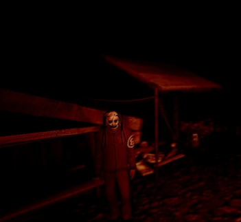

<h2>Sept 86' : Rudmerge County</h2>

Dans le cadre de la création d'un Roleplay Horreur se déroulant dans Rudmerge County où le joueur se réveil dans un conté vide et devront comprendre ce qu'il s'est passé. 

Dans ce conté il y a 3 lieux :
- Blue Pines : La ville principale cotière, une petite ville de campagne avec un motel, un poste de police, une station service, quelques restaurant et un bar. La ville est entourée de foret mais également d'une plage avec quelques pontons.
- Cassady Valley : Un passage entre les montagnes et la forêt, une route qui mène à la ville de Blue Pines. C'est le lieu de départ des gardes forestiers du fait de la présence de tour de surveillance.
- Dry Lake : Le lac asséché, un lieu de passage sec. Il y a un petit parc de Mobil Home, un bar, quelques entrepots et un lieu de recherches avec d'immenses paraboles.

###CheckList :

- [ ] Demander les disponibilités
- [ ] Demander les rôles aux joueurs
- [ ] Demander les skins aux joueurs
- [ ] Prévoir 1 fichier audio style "Ange Gabriel" pour le début du RP
- [ ] Propsing de la map
  - [x] Prévoir les lieu clés
  - [x] Lucy's Shop
  - [x] Chompsky Bar
  - [x] Joe's House
  - [x] Prévoir 2 chambres du motel
  - [ ] Prévoir les cadavres dans le bunker -- **TODO EN JEU**
  - [ ] Préparer un panneau dans le tunnel indiquant qu'au bout se trouve le conté de Mandela -- **Planquer en jeu dans le background d'un personnage**
- [x] Réaliser la collection
  - [x] Mettre la map
  - [x] Mettre les props
  - [x] Mettre les skins -- **Attendre les skins joueurs**
  - [x] Mettre les items
- [x] Planquer les énigmes censées arriver plus tard
  - [x] Placer le van échoué sur l'arbre ou se trouve la première page
  - [x] Virer la cassette de la watchtower (Mettre sous le gnome dès qu'ils auront réussi l'énigme)
  - [x] Changer la position du gnome du pont (demander d'abord l'avis a un scéna) --> Le placer a coté du livreur assommé. -- **Scéna validé**

###Combien de temps de RP ? :

- [x] 4h (de 21h30 à 01h30)
  - Venir a 21h pour préparer

###Ordre des énigmes :

- Objectifs principaux :
  - Tall Man (Récupérer les 3 pages)
  - Gnomes (Ramener les 5 gnomes au Chompsky Bar pour trouver la cassette)
  - Cassette & Bunker (Récupérer la cassette et trouver le bunker)

- Objectifs secondaires :
  - UFO (Trouver les 2 UFOs et retourner a l'observatoire pour voir le 3° se crasher)
  - Théoriser sur les mannequins (Mener l'enquète sur la disparition des mannequins)

###Les énigmes

**Tall Man** : nécessite 3 pages pour être activé. Il y a aussi un journal dans la tour de guet qui n'est pas nécessaire pour cela.

> La première page se trouve derrière la lettre H du panneau HOPE.
La 2e page est attachée à un arbre en bas de la colline, à partir de la lettre E du panneau HOPE.
La troisième est sur un arbre à côté de la tour de guet.
Collecter les 3 permet de faire apparaître le Tall Man.

**Emplacements du Tall Man :** (un seul est actif à la fois)
> Derrière le panneau HOPE
En bas de la colline depuis le panneau HOPE
Entre le panneau HOPE et la tour de guet
Derrière le bâtiment près de l'usine
Près du bâtiment vide sous le viaduc
Au cimetière près de la tour de guet
À côté de la tour de guet
Encore plus bas à partir de la lettre E

S'approcher trop près de lui déclenchera une téléportation, qui choisira alors un autre endroit aléatoire.

---------------------------------

**UFO :** Il faut trouver 2 UFOs pour l'activer. Vous devez les toucher tous les deux
> Le **1er OVNI** se trouve dans l'étang près de Dry Lake.
Le **2e OVNI** se trouve dans l'océan, dans le coin supérieur gauche de la carte.

Après avoir touché les deux, allez vers les antennes radar pour que l'OVNI écrasé apparaisse.

-------------------------------------

**Gnome :** Il faut trouver 5 gnomes et les amener à la statue du gnome au Chompsky Bar. (ATTENTION AUX SAUTS)

> **1er gnome :** Situé à l'intérieur de la boutique de Lily, dans la salle de bain.
**2e gnome :** dans la maison de Joe, assis entre l'une des tables et l'un des canapés.
**3ème gnome :** sur le viaduc ( ?) de la vallée de Cassady, assis sur le pilier droit (entre le sommet du viaduc et l'arche) le plus au nord.
Le **4e gnome** est devant une maison verte en forme de C, entre la vallée de Cassidy et le lac sec.
Le **5e gnome** se trouve à la base de l'antenne, près des antennes radar.

--------------------------------------

**Distributeur automatique :** Derrière l'usine près de Dry Lake, il y a un distributeur automatique avec du sang sur le sol. Il émet également des gémissements de temps en temps.

***Lieu de départ du Livreur***

--------------------------------------

**Mannequins :** On peut les trouver à plusieurs endroits sur la carte, en rapport avec l'un des E-mails trouvés.

Groupe de mannequins au fond de la mer à côté de l'extrémité de la jetée.
Plusieurs trouvés à l'intérieur du bunker
A l'intérieur des tunnels de maintenance

-------------------------------------

**Croix de lotus :** Les croix de lotus peuvent être trouvées tout autour de la carte.

**Emplacements des croix de lotus :**
>Derrière la lettre E du panneau HOPE
>Plusieurs à l'intérieur du bunker
>Derrière le panneau sud de Dry Lake
>Allée derrière le Motel
>Un des murs de la tour ATC à Dry Lake
>Dans les tunnels de maintenance

---------------------------------------

**Cassette :** A l'intérieur de la tour de guet, sous la télévision, il y a une cassette VHS. Vous pouvez l'apporter à la salle de conspiration dans le bâtiment à côté de Better Call Paul pour la jouer, mais c'est juste la vidéo de lavage de cerveau.

--------------------------------------

**Bunker :** Dans le tunnel près de Dry Lake, il y a une porte latérale qui mène à des sortes de tunnels de maintenance. L'une des boîtes électriques avait un clavier sur le côté. Le code est composé des chiffres de la vidéo de lavage de cerveau, soit 4217. Il n'est pas possible de faire un noclip à l'intérieur à moins d'utiliser des commandes.

-------------------------------------

**Boomboxes :** Il y a plusieurs boomboxes sur la carte. En les ramassant, elles se mettent à jouer de la musique

**Emplacement des boombox :**
>Dans la tour de guet
Dans le bâtiment de Better Call Paul
Réception du parc à roulottes

-----------------------------------

**Fantôme :** Quelque part au centre de la carte, vous pouvez trouver un fantôme sur l'un des sommets. Il disparaît dès que vous vous en approchez.

**Pièces d'histoire :** Autour de la carte, il y a une tonne d'ordinateurs avec des e-mails, des journaux, etc.

###Les Indices

**Watchtower newspaper**
>"TALLMAN
*Tall Man picture*
Legends say that a humanoid creature lives in the forests of Cassady Creek. It wanders aimlessly among the trees, and is looking for its favorite treat - children. It is rare to find parents who let their children go to the forests of Rudmerge..."

**Missing poster**
>"Police Department
City of Blue Pines
MISSING
*Mugshot*
Jacob Ford
29 years old
DESCRIPTION: Date of birth: Jule 17, 1957. Male. Height: 72.1 inches. Weight: 165lbs. Brown Hair. Brown Eyes. Wearing "Mystical Club" T-shirt. Blue Jeans. White Sneakers.
Persons having any information are requested to Call
682-200-535

**Death on East Road newspaper**
>"July 17, 1985
DEATH ON THE EAST ROAD
*House picture*
Today, the body of a former pastor the Blue Pines Church was found.
R.D. Lance, who recently suffered from schizophrenia commited suicide with a shotgun. The funeral service will take place soon in Blue Pines. Shocking details are further in the issue!"

**Rudmerge Creek Bridge newspaper**
>"Today at 9:17 AM Rudmerge creak bridge collapsed. The first version of the cause of the disaster is severe corrosion of the supporting structures of the bridge and squally wind. During the collapse at least 10 cars fell into the water of the bay.

>According to preliminary estimates, 17 people died. Searches are underway for the bodies of the dead. An investigation has begun.
One of the worst tragedies in our country has occurred.

>The first Memorial service will be held at blue pine church at 8 PM."

**The Mannequin Thief**
>"Sep-16-86
Alright, alright, this is ridiculous, but some crazy person has been stealing mannequins from county stores for about a year now. We still can't figure out who it is. When we're done with the more serious stuff, we'll be sure to find this weird guy.
I just want to see his face. Huh :)"

**Murder report**
>"Sep-17-86
Today, a man was found dead on East Road around 7 A.M.. The victim has been identified as Jonathan Gregg, born 1953, From Dry Lake. A distinctive marking was found on the corpse - a catholic cross with a lotus inside. The series of murders by Lotus Cultists continues. Already 5 munders in a year. A dismal statistic."

**Memorial plaque**
>"A memorial plaque to the memory of those who passed away in the collapse of the Rudmerge Creek Bridge on July 17, 1968."

**Gnome statue**
>"From: Henry Jones
Pin the damn gnome statue properly! It's always at different angles. Apparently, the wind. The idiots in the Paranormal Club think there's a demon or a ghost or something. They go around our place at night and make stupid videotapes. I don't want crazy people coming to our bar."

**Trailer park**
>"Sep-11-86
The residents of the trailer park and I have terrible headaches, I will lose all my clients this way. In the beginning, everything was fine, but then half a year ago they built these damn radars. We need to move closer to Charles Town, where it's quieter and my head won't feel like it's in a microwave. But so far there is no money to move..."

**Reports to the center**
>"Report for Aug 1986
No activity by China or the Soviet Union was detected.
However, there have been increased sightings of flying objects of unknown nature. On average, the speed of such an object is kept at 900-1000 MPH. No visual contact has been made.
Trying to resolve this issue."

**Roger Dwight Lance. Notes**
>"Sep-17-86
There are more and more followers of the Right Faith. The arrangement of the old bunker is almost complete. The missile silos are fully ready. On July 24, 1987, there will be a mass liberation of souls in the name of the Lord, and the breaking of the barrier between countless parallel worlds. This is the real second coming. How I'm waiting for this moment... Amen."

**Lotus Faith Precepts**
"Lotus Faith Precepts
*Lotus symbol*
>1) The Lotus is a symbol of liberation and the second coming of God from the parallel world for our salvation;
>2) There is a reality better than ours. Transition to it after death is guaranteed;
>3) Killing is liberation and a transition to another, better reality;
>4) Each death causes a rupture between worlds;
>5) Demonic entities are the result of a rupture between worlds;
>6) Mass deaths cause fluctuations and instability of parallel worlds;
>7) It makes no sense to fight against demons. We are responsible for their appearance.

**Lotus Brainwash**
>"The Lotus is the answer"
Kitten picture
"2"
"We friends"
Eye closeup picture
"17"
House picture
Lotus symbol
"The world is paralell"
"4"
Bridge picture
"Accept the truth"
Lotus picture
*Loop*

**Paranormal Activity computer**
>"Paranormal activity by year
*Diaphgragm* (Basically suddenincrease in 68, peak in 69, drop and sudden increase in 77)

#### Faire en sorte qu'un joueur soit un traitre du culte du lotus.

**Son objectif:**
> Il est au courant du précepte du culte et de l'existence du bunker mais ne sait pas ou il se trouve. Il devra donc trouver le bunker et y amener le plus de survivants possible pour le rituel.
>Le joueur ne doit tuer personne en dehors du rituel, ceci étant contraire aux préceptes du culte.
> Il est au courant de l'existence d'un bunker secret de la secte du lotus, et doit y amener le plus de survivants possible pour le rituel.
> Il doit tuer le plus de survivants possible lors du rituel.
> Pour conclure le rituel, il doit se suicider. 
> Il voit d'un mauvais oeil le complotiste car ce dernier en sait trop

**Préceptes de la foi en lotus**
*"Préceptes de foi du Lotus"*
>1) Le Lotus est le symbole de la libération et de la seconde venue de Dieu du monde parallèle pour notre salut ;
>2) Il existe une réalité meilleure que la nôtre. Le passage à cette réalité après la mort est garanti ;
>3) Tuer est une libération et une transition vers une autre réalité, meilleure ;
>4) Chaque mort provoque une rupture entre les mondes ;
>5) Les entités démoniaques sont le résultat d'une rupture entre les mondes ;
>6) Les morts massives provoquent des fluctuations et l'instabilité des mondes parallèles ;
>7) Il est absurde de lutter contre les démons. Nous sommes responsables de leur apparition.

*Ce personnage est clairement manipulé par une plus grande instance, je conseille personnellement de le rendre assez louche dans quelques unes de ces actions et de constamment chercher des signes sur les tâches qu'il semble être confier.*

--------------------------------------

#### Infos à transmettre aux rôles :

- **Voyageur résidant dans le motel de Blue Pines :**
> Ce rôle n'a aucune information particulière à transmettre. Le background du personnage est libre.
> Avant de s'endormir dans sa chambre au motel, il a pu se rendre a Joe's House pour y déguster des fruits de mer locaux. De ce fait, il a pu apercevoir le cuisinier du restaurant. Il a pu remarquer que ce dernier avait une mauvaise mine marquée par la fatigue du fait d'un long service. 

- **Complotiste de la ville de Blue Pines :**
> Il est au courant des disparitions d'enfants dans la forêt de Cassady Creek mais également de la mort de Jonathan Gregg sur la route de Dry Lake. Son but sera de relier les différentes affaire car il est au courant de l'existence du culte du lotus. Le comportemen de ce dernier se devra d'être très erratique et paranoïaque. Il devra également être très méfiant envers les autres joueurs. Lors de son reveil, sur sa boite de messagerie, il y trouve un mail : "Je sais que tu sais. Bonne chance." avec un icon de Lotus. Ce mail s'est supprimé après lecture.
> N'oublie pas, tu as un lecteur de cassette dans ton bureau.
 
- **Garde forestier de Cassady Valley :**
> Depuis son poste, ce dernier permet d'avoir une vue globale sur tout le paysage de Rudmerge County. Il a pu entendre de nombreux cris étoufés par la forêt. Juste avant de se réveiller, il a pu entendre son parquet craquer, un bruit de pas s'éloigner de lui ainsi que sa porte claquer. N'était-ce que le vent ?
> Lors de ton réveil, un sentiment de malaise t'envahit. Tu as l'impression que quelqu'un est venu dans ton bureau pendant ton sommeil. Tu as également l'impression que quelqu'un t'observe. Des bribes de souvenirs d'une autre vie arrive dans ton esprit... Que se passe-t'il ?

- **Scientifique du lieu de recherches de Dry Lake :**
> Ses travaux portaient sur la recherche de technologie pour contrer l'armement russe. Son dernier souvenir avant de s'endormir sur son travail était une fausse alerte de 2 missiles proche de la position du conté. Les dernières positions étaient dans un lac de Dry Lake et dans la mer a coté de Blue Pines.
> Lors de son service, il a pu rencontrer le livreur qui lui a ammené des pièces de rechange pour son matériel informatique.

- **Barman du bar de Blue Pines :**
> Etant donné que le bar est un bar confédéré, il est possible de jouer un personnage limite sur le racisme ou qui a subit ce genre de discrimination.
> Après une soirée très agité, il a pu entendre l'équipe de police parler des meurtres récents et donc a eu des échos d'un culte mais n'a pas pu en savoir plus. Il connait le citoyen endormi sur la plage car il lui a servi des pintes toute la soirée. Avant de s'endormir sur son bar, il a pu entendre un bruit de verre se brisant et une porte claquer. De plus, une statue de gnome a été déplacée devant son batiment. Quel est le sens de tout ça ?

- **Citoyen endormi sur la plage de Blue Pines :**
> Après une soirée arrosée au bar de Blue Pines, il s'est endormi sur la plage. Il a pu entendre des bruits de pas s'éloigner dans le sable ainsi que des bruits de vagues. Il connait de vue le barman étant donné qu'il a enchainer les pintes grace à lui.

- **Livreur assommé derrière un entrepôt :**
>  Son but étaient de transporter des caisses de matériel pour le lieu de recherches de Dry Lake. En allant boire derrière un entrepot après sa dernière livraison. Il a été assommé par un inconnu et se retrouve derrière un entrepôt. Avant de tomber, il a pu entendre des bruits de pas s'éloigner de lui ainsi que son véhicule (Camionnette Bleue) démarrer.
> Lors de son service, il a pu rencontrer le scientifique du lieu de recherches de Dry Lake.
> L'entreprise qui l'emploie est une compagnie de livraison de matériel informatique du nom de "Mandela Delivery" présent dans le conté de Mandela.

- **Prêtre de l'église de Blue Pines :**
> Le prêtre n'as eu que des échos concernant le culte du lotus et concernant toutes les controverses qui l'entourent. Lors de sa prière du soir, il s'est malheureusement endormis sur le banc de l'église. Il a pu entendre des bruits de pas s'éloigner de lui ainsi que la porte de l'église claquer. 
> A son réveil, à ses pieds, se trouve un chapelet mais la croix a été changé en un lotus taillé grossièrement dans un morceau de métal.

- **Cuisinier de Joe's House (restaurant de fruits de mer) :**
> Lors de son service qui fut très long, ce dernier s'endormis sur son plan de travail lors de la plonge. Du fait du reste du travail, tout le monde étaient partis et donc avait la charge de fermer le restaurant. Ce qui l'a reveillé était un bruit de verre se brisant, une bouteille de whisky s'étaient brisée sur le sol. 
> Il connait de vue les riverains.

#### L'homme au masque

*C'est un personnage qui sera joué en admin et fera quelques apparitions pour éloigner des lieux avec aucun rapport avec l'énigme actuelle.*

### La fin ?

Sur la dernière énigme, le bunker, les joueurs découvrent une cassette cryptique sous le gnome après l'avoir déplacé.
Ils devront retourner en ville pour lire la cassettte, déchiffrer le code et ensuite retourner au bunker pour y entrer.
Une fois dans le bunker, ils arriveront dans une complexe militaire qui a été retapé par le culte du lotus.
Dans ce dernier, une première partie du rituel sera visible, on verra les membres de la secte sur le sol, morts.
Le joueur qui a le rôle de l'adepte caché devra se suicider pour finir le rituel.

2 fins sont possibles :
- Soit l'adepte caché a réussi a tuer le plus de survivants possible et donc le rituel est réussi. Mettant fin à la partie.
- Soit les joueurs arrivent à tuer l'adepte caché et donc le rituel est raté. Les joueurs peuvent alors sortir du bunker et mettre fin à la partie.

Dans tout les cas, une message leurs sera parvenu à la fin comme un appel radio provenant de la tour de guet du Garde Forestier. 
C'est un appel provenant de la ville de Blue Pines, la vrai, disant que : 
> "L'expérience n°37 s'est parfaitement déroulée. Les faux souvenirs ont bien fait effet sauf sur un sujet, pensez à augmenter les doses. Nous avons besoin de l'équipe de nettoyage. Nous avons brièvement perdu le contrôle mais tout les signes placés afin de créer la démence et pousser à la folie les ont dirigés dans état de délire collectif. Les alternés se sont rapidements occupés d'eux. Les sujets ont perdu l'esprit, veillez à nettoyer les lieux. Nous enverrons les prochains sujets dès demain soir."

Ce qu'il faut en comprendre, c'est que les joueurs étaient des sujets d'une expérience d'une fondation censé combattre les alternés. Leur but est d'envoyer des sujets afin de tester les effets de la démence que provoque les alternés.